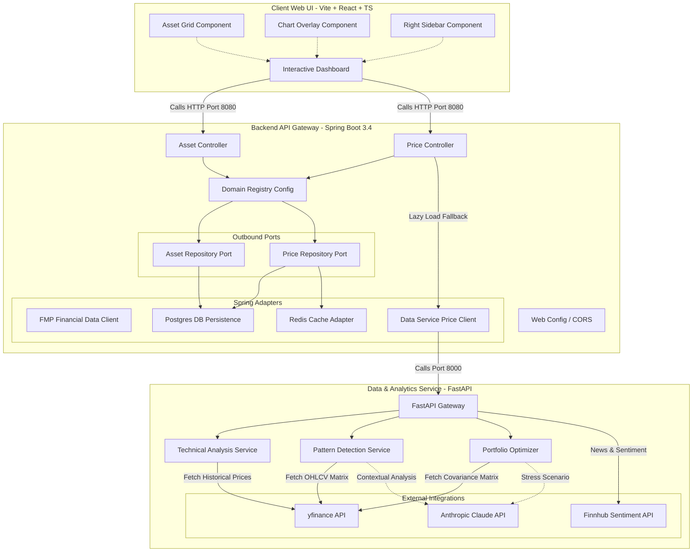

# 📊 Hybrid Financial Analysis Engine

Welcome to the **Hybrid Financial Analysis Engine**! This is a state-of-the-art, high-performance web application designed for comprehensive financial analysis, technical indicator evaluation, portfolio optimization, and AI-driven market insights. 

The project is structured as a **Monorepo** comprising three primary services designed to run in harmony:
1.  **Spring Boot Backend** (`backend/`): A pure Java 17 enterprise core utilizing Hexagonal Architecture.
2.  **FastAPI Data Service** (`data-service/`): A high-frequency analytics, technical analysis, and portfolio optimization engine.
3.  **Vite + React Frontend** (`frontend/`): A state-of-the-art interactive dashboard with high-end premium aesthetics.

---

## 🏛️ System Architecture

The following diagram illustrates the data flow and boundary interactions between the three primary services:



---

## 🚀 Core Features

### 1. Hexagonal Java Backend Core
*   **Hexagonal (Ports & Adapters) Architecture**: Complete decoupling of core domain models and logic from third-party frameworks, keeping the business logic pristine and easily testable.
*   **Lazy-Loaded Price History Engine**: Price controllers query local Postgres storage first. On a cache/db miss, they delegate on-demand loading of price candles to the FastAPI data-service, persist the fetched data, and return it.
*   **Robust Caching**: Utilizes Redis for high-frequency `latestPriceCache` caching to avoid hitting external rate limits.

### 2. Advanced Python Analytics & Technical indicators
*   **Technical Indicator Pipeline**: Fast calculations of RSI, MACD (signal & histogram), Bollinger Bands, ATR, EMA, and SMA using `pandas-ta`.
*   **Pattern Recognition Engine**: Built-in algorithmic detection of classical chart patterns (e.g., Double Tops/Bottoms, Head and Shoulders) from OHLCV data.
*   **Modern Portfolio Optimization**: Markowitz Mean-Variance Optimization, Risk Parity, and custom target risk thresholds calculated with `PyPortfolioOpt` and `cvxpy`.
*   **AI Context & Sentiment Integrations**: News sentiment feeds via Finnhub, combined with Anthropic Claude for intelligent stress-testing and pattern explanation text.

### 3. Premium Interactive Dashboard
*   **High-End Dark Aesthetics**: Glassmorphic UI containers, curated harmonized gradients, dynamic hover effects, and custom fonts.
*   **Active Chart Overlays**: Live canvas plotting historical price candles alongside Bollinger Bands, SMA, EMA, and other indicators.
*   **Granular Signals**: Comprehensive sidebar reflecting BUY/HOLD/SELL suggestions with confidence metrics alongside AI insights.

---

## ⚙️ Service Ports & Environment

The systems expect a fixed deployment mapping for local development:

| Part | Tech Stack | Dev Port | Main Responsibilities |
| :--- | :--- | :--- | :--- |
| **Backend** | Spring Boot 3.4 / Java 17 | `8080` | Domain processing, persistence, Redis caching, FMP client adapter |
| **Data-Service**| FastAPI / Python 3.10+ | `8000` | PyPortfolioOpt, pandas-ta indicators, yfinance proxy, AI insights |
| **Frontend** | Vite / React / TypeScript | `5173` | Rich interactive visualization, client-side hooks, lifted state |
| **PostgreSQL**| Database | `5433` | Historical OHLCV candle storage, tracked assets metadata |
| **Redis** | In-Memory Cache | `6379` | High-frequency latest price endpoints caching |

---

## API Documentation

- API Docs: http://localhost:8080/swagger-ui.html (backend ayaktayken)
- OpenAPI spec: docs/openapi.yaml

## 🛠️ Step-by-Step Local Deployment

### 1. Configure the Environment
Create a `.env` file in the root workspace folder based on `.env.example`:
```ini
DB_NAME=financedb
DB_USERNAME=finance_user
DB_PASSWORD=your_secure_password
REDIS_PORT=6379
FMP_API_KEY=your_fmp_api_key
FINNHUB_API_KEY=your_finnhub_api_key
ANTHROPIC_API_KEY=your_anthropic_api_key
```

### 2. Spin Up Infrastructure (Docker)
Start the PostgreSQL, Redis, and FastAPI services:
```bash
docker-compose up -d
```

### 3. Start the Spring Boot Backend
Navigate to the `backend/` directory and run:
```bash
cd backend
# Windows
.\mvnw.cmd spring-boot:run
# macOS/Linux
./mvnw spring-boot:run
```

### 4. Start the Frontend Dev Server
Navigate to the `frontend/` directory, install packages, and launch:
```bash
cd frontend
npm install
npm run dev
```
Open `http://localhost:5173` in your browser.

---

## 🧪 Running the Test Suites

### Backend Unit & Integration Tests
Run from the `backend/` directory:
```bash
.\mvnw.cmd test
```
> [!IMPORTANT]
> The backend integration tests use **Testcontainers** to spin up a real PostgreSQL 16 instance. **Docker must be running** on your machine for the context-loading tests to pass.

### Data-Service Python Tests
Navigate to `data-service/` and run:
```bash
cd data-service
python -m pytest
```

### Frontend Linters & Verification
Validate TypeScript and code styling in `frontend/`:
```bash
cd frontend
npm run lint
npm run build
```

---

## 🤝 Contribution Guidelines
For architectural principles, code conventions, or design tokens guidelines, please read the [CONTRIBUTING.md](file:///c:/Users/basar/IdeaProjects/finance-project/CONTRIBUTING.md) and [AGENTS.md](file:///c:/Users/basar/IdeaProjects/finance-project/AGENTS.md) documents.
