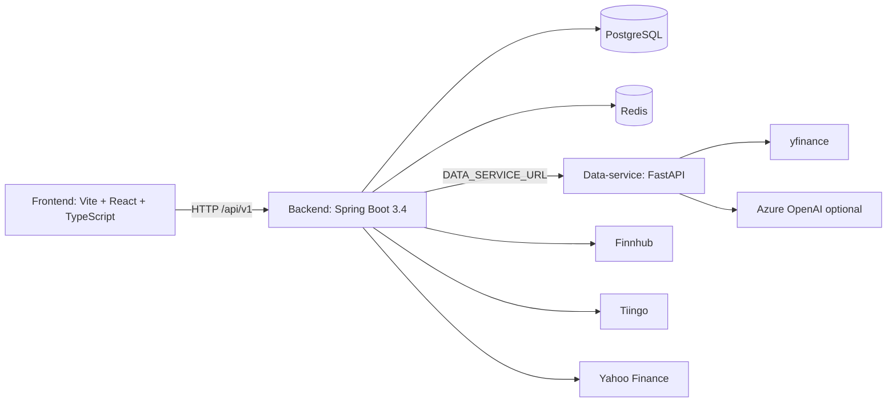

# SPEC.md

## 1. Project Overview

Finance Project is a monorepo financial analysis platform with three runtimes: `backend/` (Spring Boot 3.4 + Java 17), `data-service/` (FastAPI analytics and provider proxy), and `frontend/` (Vite + React + TypeScript). The product supports market asset tracking, prices, technical analysis, fundamentals, news, analyst data, portfolio dashboards, journal trades, watchlists, reports, backtests, chat/insight flows, and multi-agent market analysis.

Primary flow:

1. The frontend calls `http://localhost:8080/api/v1` through `frontend/src/api/client.ts`.
2. The backend validates and orchestrates requests, applies domain rules, persists data in PostgreSQL, caches selected results in Redis, and calls the FastAPI data-service or external providers when needed.
3. The data-service performs analytics and provider access through `yfinance`, `pandas`, `pandas-ta`, portfolio services, and optional Azure OpenAI-backed agents.

Fixed local ports:

| Runtime | Port | Purpose |
| --- | ---: | --- |
| Backend | `8080` | REST API under `/api/v1`, Actuator health, Prometheus metrics |
| Data-service | `8000` | Analytics, provider proxy, research, portfolio optimization, agent analysis |
| Frontend | `5173` | Vite development UI |
| PostgreSQL | `5433` | Backend relational persistence |
| Redis | `6379` | Backend cache |
| Prometheus | `9090` | Metrics scraping |
| Grafana | `3000` | Metrics visualization |
| MongoDB | `27017` | Reserved document storage for raw/news/analysis data |

## 2. Project Scope

In scope:

- Asset tracking, lookup, batch add, and removal.
- Latest price and historical OHLCV access.
- Lazy price history loading: PostgreSQL first, data-service fallback, then persistence.
- Portfolio positions, summary, allocation, performance, enriched position data, optimization, and rebalance checks.
- Multi-portfolio account tracking with a transaction ledger and derived holdings for manual/CSV investment management.
- Trading journal persistence, pagination, update/delete flows, and stats.
- Watchlists and watchlist symbol management.
- Technical indicators, technical signal summaries, pattern detection, sentiment, and decision support.
- Fundamentals, ratios, earnings, insider activity, institutional ownership/scores, valuation, risk, factors, and composite research.
- Company reports, smart reports, backtests, chat, LLM insight, and multi-agent analysis.
- Local infrastructure through Docker Compose.

Out of scope for the current implementation:

- Production authentication, authorization, and user isolation.
- Brokerage integration or real-money order execution.
- Guaranteed real-time data latency.
- Financial advice guarantees; analysis outputs are decision-support only.

## 3. Architecture

The system uses a three-runtime architecture:



Backend rules:

- Preserve hexagonal architecture.
- Framework-free domain models and services live under `backend/src/main/java/.../domain`.
- Outbound ports live under `domain/port/outbound`.
- Spring-specific code lives in `adapter/*` or `config/*`.
- Pure use cases are registered through `DomainConfig.java`; do not add Spring annotations to domain services unless the pattern changes project-wide.
- Inbound adapters are REST controllers and scheduled jobs.
- Outbound adapters include JPA repositories, Redis cache, data-service clients, Yahoo, Tiingo, and Finnhub clients.
- Scheduled jobs stay thin. `PriceIngestionJob` delegates to `PriceIngestionUseCase`.

Data-service rules:

- `main.py` owns app startup and the provider-chain price endpoint.
- `app/routers/*` expose API modules.
- `app/services/*` contain analytics and orchestration logic.
- `app/providers/*` isolate external provider behavior.
- `app/models/*` define Pydantic contracts.


Agent analysis orchestration:

- Backend entrypoint: `GET /api/v1/agent-analysis/{ticker}`.
- Backend facade checks Redis-backed agent-analysis cache first. Cache TTL is controlled by `agent-analysis.cache-ttl-minutes`.
- On cache miss, `AgentAnalysisUseCase` builds a metrics-only snapshot:
  - latest price from `PriceRepositoryPort`;
  - income and balance statements through `FinancialStatementClientPort`;
  - price history through `FinancialDataPort`, with repository fallback;
  - sentiment through `SentimentDataPort`, defaulting to neutral sentiment when unavailable;
  - fundamental, valuation, technical, and risk metrics computed in-domain.
- Backend calls `AgentAnalysisAiPort`; the active adapter is `DataServiceAgentAnalysisAdapter`, which sends `POST {DATA_SERVICE_URL}/api/v1/agent-analysis`.
- Data-service `AgentAnalysisService` delegates to `MetricsTradingAgentsGraph.propagate()`.
- Agent order is strictly sequential: Fundamental Analyst -> Technical Analyst -> Risk Analyst -> Bull Researcher -> Bear Researcher -> Portfolio Manager.
- Agents receive pre-calculated metrics only. They must not fetch external data, call tools, or recalculate metrics.
- Azure OpenAI access is created inside `MetricsTradingAgentsGraph._llm_client()` through `AzureChatOpenAI` using `AZURE_OPENAI_ENDPOINT`, `AZURE_OPENAI_API_KEY`, `AZURE_OPENAI_API_VERSION`, `AZURE_OPENAI_DEPLOYMENT_NAME`, and `LLM_MAX_TOKENS` from data-service settings.
- Data-service records Prometheus metrics for end-to-end latency, failures, and estimated Azure token usage.
- Backend persists successful agent-analysis output to `agent_analysis_history` and writes the cache entry. If the data-service call fails, the adapter returns `Optional.empty()` and the API should degrade without synthetic analysis text.

Frontend rules:

- `App.tsx` owns the `BrowserRouter`; `Dashboard.tsx` composes the routed application shell.
- User-facing pages use React Router browser paths rather than tab-only state. Transient UI state such as selected symbol, modals, drawers, chart ranges, filters, and table sorting remains component state.
- Hooks under `frontend/src/hooks` own data fetching and loading/error state.
- API contracts live in `frontend/src/api` or near the hook that uses them.
- Styling must use tokens in `frontend/src/index.css`.
- Frontend browser routes and backend `/api/v1` endpoints are separate contracts; adding a frontend route must not rename backend endpoints.

## 4. Repository Structure

```text
.
|-- backend/                       Spring Boot backend
|   |-- src/main/java/.../domain    Framework-free domain models, services, ports
|   |-- src/main/java/.../adapter   REST, persistence, client, scheduler adapters
|   |-- src/main/java/.../config    Spring configuration and domain bean registration
|   |-- src/main/resources          application.yml and database migrations
|   `-- src/test/java               Backend tests
|-- data-service/                   FastAPI analytics and provider service
|   |-- app/routers                 Route modules
|   |-- app/services                Analytics services
|   |-- app/providers               Provider adapters and resolver
|   |-- app/models                  Pydantic models
|   `-- tests                       pytest suite
|-- frontend/                       Vite + React + TypeScript UI
|   |-- src/api                     Axios client and API types
|   |-- src/components              UI components
|   |-- src/hooks                   Data hooks
|   |-- src/pages                   Page composition
|   `-- src/index.css               Design tokens
|-- docs/                           Supporting rules and architecture docs
|-- docker-compose.yml              Local services
|-- prometheus.yml                  Metrics scrape config
|-- AGENTS.md                       Agent instructions
|-- README.md                       Project overview
`-- SPEC.md                         This specification
```

## 5. Coding Standards

General:

- Preserve endpoint paths, request shapes, response field names, and frontend consumers unless all affected layers are updated together.
- Keep edits scoped to the relevant module.
- Add or update tests near the changed behavior.
- Do not fabricate market data. Missing provider data returns empty collections, `null` optional fields, or partial objects.

Backend:

- Use Java 17 and Spring Boot 3.4 conventions.
- Keep domain models framework-free and invariant-enforcing.
- Use ports for persistence, cache, and external calls.
- Prefer MapStruct mappers under `adapter/**/mapper/*` over manual mapping.
- Keep controllers thin and delegate to use cases/ports.
- Keep `spring.jpa.open-in-view=false` behavior in mind; load required data explicitly.

Data-service:

- Use typed Pydantic request/response models.
- Keep provider-specific behavior inside provider adapters/resolvers.
- Keep analytics deterministic for identical inputs.
- Respect `TechnicalAnalysisService.MIN_CANDLES` for technical analysis.

Frontend:

- Keep API-facing types in `frontend/src/api` or nearby hook-specific types.
- Hooks own loading/error/data state.
- Components should stay presentational where practical.
- New UI must match existing design tokens and terminal/dashboard density.

## 6. Domain Rules

- `Asset` represents a tracked instrument. Symbols should be normalized consistently, generally uppercase.
- `AssetType` classifies instruments. Batch-add fallback creates a minimal `STOCK` asset.
- `PriceHistory` represents an OHLCV candle and must preserve valid price, volume, and timestamp invariants.
- Latest price derives from stored or fetched price history and may be cached.
- Journal trades persist through `JournalTradePort`; controllers must not store journal state in memory.
- Watchlists persist through `WatchlistPort`; controllers must not store watchlist state in memory.
- Agent analysis results are cached and persisted for history/audit.
- Portfolio calculations must distinguish quantity, cost basis, market value, allocation, daily return, total return, and unrealized PnL.
- Financial, risk, and technical calculations belong in domain/data-service analytics services, not controllers.

## 7. API Specification

Backend base URL: `http://localhost:8080/api/v1`.

Frontend browser routes are handled by React Router and are distinct from backend API endpoints:

| Route | Purpose |
| --- | --- |
| `/` | Redirect to `/dashboard` |
| `/dashboard` | Dashboard home |
| `/workspace` and `/workspace/{symbol}` | Chart workspace, optionally scoped to a market symbol |
| `/portfolio` and `/portfolio/{portfolioId}` | Portfolio page, optionally scoped to a portfolio id |
| `/transactions` | Transactions page |
| `/journal` | Trading journal page |
| `/watchlist` | Watchlist/market grid page |
| `/news` and `/news/{symbol}` | News hub, optionally scoped to a market symbol |
| `/reports` and `/reports/{symbol}` | Reports page, optionally scoped to a market symbol |

The frontend API mapping is documented in `docs/FRONTEND_API.md` and must stay aligned with this section.

| Area | Method and path | Purpose |
| --- | --- | --- |
| Assets | `GET /assets` | List tracked assets |
| Assets | `GET /assets/{symbol}` | Fetch one asset |
| Assets | `POST /assets/batch` | Add symbols in batch; Yahoo metadata first, fallback `STOCK` |
| Assets | `DELETE /assets/{symbol}` | Delete asset |
| Prices | `GET /prices/{symbol}/latest` | Latest price candle through DB-first refresh and `priceCache` |
| Prices | `GET /prices/{symbol}/history?interval=&range=` | Historical candles with DB-first lazy loading, refresh, persistence, and `priceCache` |
| Technical | `GET /technical/{symbol}?interval=&range=` | Technical indicators |
| Technical | `GET /technical/{symbol}/signals?interval=&range=` | Technical signal summary |
| Agent analysis | `GET /agent-analysis/{ticker}` | Cached or computed multi-agent analysis |
| Agent analysis | `DELETE /agent-analysis/{ticker}/cache` | Evict one ticker cache |
| Agent analysis | `DELETE /agent-analysis/cache` | Evict all agent-analysis cache |
| Analyst | `GET /analyst/{symbol}/recommendations` | Analyst recommendation trends |
| Analyst | `GET /analyst/{symbol}/price-target` | Price target data |
| Backtest | `GET /backtest/{symbol}` | Strategy backtest result |
| Chat | `POST /chat/ask` | Chat/insight request |
| Reports | `GET /reports/company/{symbol}` | Company report |
| Reports | `GET /reports/smart/{symbol}` | Smart report |
| Reports | `GET /reports/test` | Diagnostic report endpoint |
| Fundamentals | `GET /fundamentals/{symbol}` | Fundamental series, including nullable `dividendYield` when provider metrics are available |
| Fundamentals | `GET /fundamentals/{symbol}/ratios` | Financial ratios |
| Fundamentals | `GET /fundamentals/{symbol}/earnings?periods=` | Earnings history |
| Fundamentals | `GET /fundamentals/{symbol}/insider` | Insider activity |
| Fundamentals | `GET /fundamentals/{symbol}/institutional` | Institutional ownership/scores |
| News | `GET /news?category=&page=&size=&symbols=` | Categorized news page |
| News | `GET /news/portfolio` | Portfolio-related news |
| News | `GET /news/{symbol}` | Symbol news |
| Notifications | `GET /notifications` | List notifications |
| Notifications | `GET /notifications/unread` | List unread notifications |
| Notifications | `POST /notifications/read-all` | Mark all notifications read |
| Macro | `GET /macro/snapshot` | FRED macro snapshot; returns 503 when all macro fields are unavailable |
| Market calendar | `GET /calendar?symbols=` | Combined FMP earnings and high-impact economic calendar |
| Market calendar | `GET /calendar/earnings?symbols=` | FMP earnings calendar, optionally symbol-filtered |
| Market calendar | `GET /calendar/economic-events` | FMP high-impact economic events |
| Portfolio positions | `GET /portfolio/positions` | List positions |
| Portfolio positions | `POST /portfolio/positions` | Create position |
| Portfolio positions | `PUT /portfolio/positions/{id}` | Update position |
| Portfolio positions | `DELETE /portfolio/positions/{id}` | Delete position |
| Portfolio dashboard | `GET /portfolio/summary` | Portfolio totals and PnL summary; daily PnL is derived from the latest two real closes when available |
| Portfolio dashboard | `GET /portfolio/performance?period=&benchmark=` | Performance series derived from refreshed real price history; optional benchmark fills normalized `benchmarkValue`; returns an empty series when no real price history exists |
| Portfolio dashboard | `GET /portfolio/performance/comparison?period=&portfolioIds=&benchmarks=` | Multi-series comparison contract; degrades to an empty `series` array when no real comparison data is available |
| Portfolio dashboard | `GET /portfolio/positions/performance?portfolioId=` | Ledger position performance; missing provider prices return nullable period fields rather than fabricated returns |
| Portfolio dashboard | `GET /portfolio/allocation` | Allocation slices |
| Portfolio dashboard | `GET /portfolio/positions/enriched` | Positions enriched with latest real price and PnL |
| Portfolio analytics | `POST /portfolio/optimize` | Portfolio optimization |
| Portfolio analytics | `POST /portfolio/rebalance-check` | Rebalance analysis |
| Journal | `GET /journal/trades?page=&size=&sort=` | Paged journal trades; open trades are enriched with latest real price at read time |
| Journal | `GET /journal/trades/stats` | Journal stats derived from persisted trades with open-trade latest price enrichment |
| Journal | `POST /journal/trades` | Create journal trade |
| Journal | `PUT /journal/trades/{id}` | Update journal trade |
| Journal | `DELETE /journal/trades/{id}` | Delete journal trade |
| Watchlists | `GET /watchlists` | List watchlists |
| Watchlists | `POST /watchlists` | Create watchlist |
| Watchlists | `POST /watchlists/{id}/symbols` | Add symbol |
| Watchlists | `GET /watchlists/{id}/research-snapshot?limit=&offset=&symbols=&refresh=` | Research snapshot contract with partial/EMPTY sections when providers are unavailable; no synthetic market data |
| Watchlists | `DELETE /watchlists/{id}/symbols/{symbol}` | Remove symbol |
| Watchlists | `DELETE /watchlists/{id}` | Delete watchlist |
| Investment portfolios | `GET /portfolios` | List user portfolios such as ABD, BIST, funds, or gold |
| Investment portfolios | `POST /portfolios` | Create a portfolio with a base currency |
| Investment portfolios | `PUT /portfolios/{id}` | Update portfolio metadata |
| Investment portfolios | `DELETE /portfolios/{id}` | Delete a portfolio and its transaction ledger |
| Portfolio ledger | `GET /portfolios/{id}/transactions` | List manual/CSV transaction ledger entries |
| Portfolio ledger | `POST /portfolios/{id}/transactions` | Add BUY/SELL/dividend/cash/manual valuation transaction; optional journal note is linked, not used to delete history |
| Portfolio ledger | `DELETE /portfolios/{id}/transactions/{transactionId}` | Delete one transaction entry and remove any linked journal trade for that transaction |
| Portfolio ledger | `GET /portfolios/{id}/holdings` | Derived current holdings from transaction ledger |

Data-service endpoints:

| Area | Method and path | Purpose |
| --- | --- | --- |
| Prices | `GET /api/v1/prices/{symbol}` | OHLCV price history through provider chain |
| Analysis | `GET /api/v1/analysis/technical/{symbol}` | Technical indicators |
| Analysis | `GET /api/v1/analysis/technical/{symbol}/signals` | Signal summary |
| Analysis | `GET /api/v1/analysis/sentiment/{symbol}` | Sentiment analysis |
| Analysis | `POST /api/v1/analysis/insight` | LLM insight |
| Analysis | `GET /api/v1/analysis/full/{symbol}` | Combined analysis |
| Analysis | `GET /api/v1/analysis/patterns/{symbol}` | Pattern detection |
| Analysis | `POST /api/v1/analysis/decision-support` | Decision support |
| Agent analysis | `POST /api/v1/agent-analysis` | Multi-agent analysis |
| Macro | `GET /api/v1/macro/snapshot` | FRED macro snapshot cached for 4 hours |
| Market calendar | `GET /api/v1/calendar?symbols=` | Combined FMP calendar cached until midnight UTC |
| Market calendar | `GET /api/v1/calendar/earnings?symbols=` | FMP earnings calendar, optionally symbol-filtered |
| Market calendar | `GET /api/v1/calendar/economic-events` | FMP high-impact economic calendar events |
| Backtest | `GET /api/v1/backtest/{symbol}` | Backtest response |
| Chat | `POST /api/v1/chat` | Chat response |
| Health | `GET /health/provider/yahoo` | Yahoo provider health |
| Health | `GET /health/provider/tiingo` | Tiingo provider health |
| Health | `GET /health/provider/finnhub` | Finnhub provider health |
| Health | `GET /health/providers` | All provider health |
| Health | `GET /health/metrics` | Resolver metrics |
| Portfolio | `POST /api/v1/portfolio/optimize` | Optimization |
| Portfolio | `POST /api/v1/portfolio/rebalance-check` | Rebalance check |
| Portfolio | `GET /api/v1/portfolio/efficient-frontier/{symbols}` | Efficient frontier |
| Research | `GET /api/v1/research/fundamental/{symbol}` | Fundamental analysis |
| Research | `GET /api/v1/research/valuation/{symbol}` | Valuation |
| Research | `GET /api/v1/research/risk/{symbol}` | Risk analytics |
| Research | `GET /api/v1/research/earnings/{symbol}` | Earnings |
| Research | `GET /api/v1/research/factors/{symbol}` | Factor analysis |
| Research | `GET /api/v1/research/institutional-scores/{symbol}` | Institutional scores |
| Research | `GET /api/v1/research/composite/{symbol}` | Composite investment score |


Critical response examples:

Asset list (`GET /api/v1/assets`):

```json
[
  {
    "symbol": "AAPL",
    "name": "Apple Inc.",
    "type": "STOCK"
  }
]
```

Price history (`GET /api/v1/prices/AAPL/history?interval=1d&range=1mo`):

```json
[
  {
    "assetId": "AAPL",
    "open": 190.12,
    "high": 194.25,
    "low": 189.5,
    "close": 193.42,
    "volume": 53120000,
    "timestamp": "2026-06-26T20:00:00Z"
  }
]
```

Technical analysis (`GET /api/v1/technical/AAPL`):

```json
{
  "symbol": "AAPL",
  "rsi": 58.4,
  "macd": 1.21,
  "macdSignal": 0.93,
  "bbUpper": 205.12,
  "bbLower": 181.44,
  "signalAction": "HOLD",
  "signalConfidence": 64
}
```

Portfolio summary (`GET /api/v1/portfolio/summary`):

```json
{
  "totalValue": 125000.75,
  "cashBalance": 10000.0,
  "dailyPnL": 850.25,
  "dailyPnLPercent": 0.68,
  "totalPnL": 14500.5,
  "totalReturn": 13.12
}
```

Journal trade (`GET /api/v1/journal/trades` content item):

```json
{
  "id": 42,
  "symbol": "MSFT",
  "company": "Microsoft Corporation",
  "type": "BUY",
  "quantity": 10,
  "purchasePrice": 410.25,
  "currentPrice": 425.1,
  "status": "OPEN",
  "openedAt": "2026-06-01",
  "pnl": 148.5,
  "returnPct": 3.62
}
```

Watchlist (`GET /api/v1/watchlists`):

```json
[
  {
    "id": 7,
    "name": "Core Tech",
    "symbols": ["AAPL", "MSFT", "NVDA"],
    "createdAt": "2026-06-20T12:30:00"
  }
]
```

Company report (`GET /api/v1/reports/company/AAPL`):

```json
{
  "symbol": "AAPL",
  "technical": {
    "rsi": 58.4,
    "signalAction": "HOLD",
    "signalConfidence": 64
  },
  "recommendations": [
    { "period": "2026-06", "strongBuy": 12, "buy": 18, "hold": 8, "sell": 1, "strongSell": 0 }
  ],
  "priceTarget": {
    "targetHigh": 260.0,
    "targetLow": 180.0,
    "targetMean": 225.5,
    "numberOfAnalysts": 39
  },
  "recentNews": []
}
```

Agent analysis (`GET /api/v1/agent-analysis/AAPL`):

```json
{
  "ticker": "AAPL",
  "decision": "HOLD",
  "confidence": 72,
  "fundamental_summary": "Margins remain resilient...",
  "technical_summary": "Momentum is neutral to positive...",
  "risk_summary": "Volatility is moderate...",
  "bull_case": "Strong cash generation supports upside...",
  "bear_case": "Valuation compression is the main downside...",
  "portfolio_manager_reasoning": "Position sizing should remain balanced...",
  "metrics_used": {},
  "generated_at": "2026-06-28T10:15:00Z",
  "from_cache": false
}
```

## 8. Error Handling

Endpoint-level error conditions, provider failure mappings, auth error targets, and frontend handling guidance are cataloged in `docs/ERROR_CATALOG.md`.
- Provider failures degrade gracefully with empty lists, optional `null` fields, or partial DTOs where the endpoint contract allows.
- Fake market data is forbidden.
- Validation errors should return client-error status codes with clear messages.
- Missing single resources should return `404`.
- Data-service endpoints must clearly report insufficient input data, especially for technical analysis with fewer than 30 candles.
- Backend provider clients should use configured resilience where available: rate limiter, retry, circuit breaker, and bulkhead.
- Frontend hooks should expose loading and error states without breaking the whole dashboard.

HTTP status code contract:

| Status | Use when | Example |
| ---: | --- | --- |
| `200 OK` | Successful read or update returning a body | `GET /assets`, `GET /prices/AAPL/history` |
| `201 Created` | A new persisted resource is created, when implemented by the controller | `POST /portfolio/positions`, `POST /watchlists` |
| `204 No Content` | Successful delete or command with no response body | `DELETE /assets/AAPL`, `DELETE /watchlists/7` |
| `400 Bad Request` | Malformed request, invalid enum, invalid number/date format, missing required query/body field | negative quantity, invalid `openedAt`, unknown `JournalTradeType` |
| `404 Not Found` | Requested single resource does not exist | unknown asset, position id, watchlist id, journal trade id |
| `409 Conflict` | Request conflicts with existing state or uniqueness constraints | duplicate asset/watchlist name where uniqueness is enforced, duplicate `(asset_id, price_timestamp)` insertion |
| `422 Unprocessable Entity` | Request is syntactically valid but violates business rules | technical analysis with fewer than 30 candles, invalid portfolio optimization constraints |
| `429 Too Many Requests` | Provider/client rate limit is reached and cannot be degraded | non-cacheable Finnhub rate limit exhaustion |
| `502 Bad Gateway` | Upstream provider/data-service returns an invalid response | malformed provider payload |
| `503 Service Unavailable` | Required dependency is unavailable and no fallback can satisfy the request | data-service unavailable for an endpoint that has no local fallback |
Error response shape should be stable for new handlers:

```json
{
  "timestamp": "2026-06-28T10:15:00Z",
  "status": 422,
  "error": "Unprocessable Entity",
  "message": "Technical analysis requires at least 30 candles",
  "path": "/api/v1/technical/AAPL"
}
```

## 9. Data Models

Core backend domain models:

- `Asset`: symbol, name, type.
- `AssetType`: instrument classification.
- `PriceHistory`: open, high, low, close, volume, timestamp, asset relationship.
- `PortfolioPosition`: symbol, quantity, average cost, opened date, notes.
- `JournalTrade`: symbol, trade type, quantity, purchase/current price, commission, strategy, notes, tags, opened/closed dates, status, PnL fields.
- `Watchlist`: id, name, symbols, created timestamp.
- `OpportunityNotification`: opportunity/radar notification state.
- `FundamentalSnapshot`: fundamental snapshot values.
- `FinancialStatement`: statement period and values.
- `SmartReport`: report output.
- `BacktestResult`: backtest metrics and series.
- `AgentAnalysisResult`, `AgentMetricSnapshot`, `AgentSentimentSnapshot`: agent-analysis output and support metrics.

Persistent tables include:

- `assets`
- `price_histories`
- `portfolio_positions`
- `journal_trades`
- `journal_trade_tags`
- `watchlists`
- `watchlist_symbols`
- `opportunity_notifications`
- `fundamental_snapshots`
- `financial_statements`
- `agent_analysis_history`

Frontend API models include `Asset`, `PriceHistory`, `NewsItem`, `CategorizedNewsItem`, `PortfolioPosition`, `EnrichedPosition`, `PortfolioSummary`, `PortfolioPerformanceResponse`, `PortfolioAllocation`, `JournalTrade`, `JournalStats`, `Watchlist`, `FundamentalsData`, `FinancialRatios`, `EarningsResult`, `InsiderActivity`, `InstitutionalHolder`, `TechnicalResult`, `CompanyReport`, `AnalystRecommendation`, and PriceTarget.

Entity relationships and persistence semantics:

| Relationship | Cardinality | Current implementation | Cascade/delete behavior |
| --- | --- | --- | --- |
| `Asset` -> `PriceHistory` | 1-to-many by symbol | `PriceEntity.assetId` is a plain column matching `AssetEntity.symbol`; no JPA `@ManyToOne` is declared | Do not assume JPA cascade. Deleting an asset must explicitly decide what happens to `price_history` rows. Keep unique key `(asset_id, price_timestamp)`. |
| `Watchlist` -> symbols | 1-to-many value collection | `WatchlistEntity.symbols` uses `@ElementCollection(fetch = EAGER)` with `watchlist_symbols.watchlist_id` and ordered symbols | Element collection rows are owned by the watchlist and are removed/replaced with the owning watchlist collection. Symbols are values, not asset foreign keys. |
| `JournalTrade` -> tags | 1-to-many value collection | `JournalTradeEntity.tags` uses `@ElementCollection(fetch = EAGER)` with `journal_trade_tags.trade_id` and ordered tags | Tags are owned values and should be deleted with the owning journal trade. |
| `PortfolioPosition` -> `Asset` | many positions may reference one symbol | Position stores `symbol`; no required JPA association to `AssetEntity` should be assumed | Do not rely on cascade from asset to position unless explicitly added with a migration and adapter change. |
| `AgentAnalysisHistory` -> ticker | many history rows per ticker | `AgentAnalysisHistoryEntity.ticker` is a plain indexed/logical symbol field | History rows are append-only audit data unless an explicit retention policy is implemented. |
| `FinancialStatement` / `FundamentalSnapshot` -> symbol | many rows per symbol and period | Repository adapters handle symbol/period access | Preserve period uniqueness rules from migrations/adapters when adding new statement data. |

## 10. Business Rules

- Asset batch-add tries Yahoo metadata first and falls back to a minimal `STOCK` asset.
- Price history reads from PostgreSQL before calling the provider chain through `FinancialDataPort`.
- Latest and historical price reads use `PriceRefreshService`: local data first, provider refresh when needed, persist fetched rows, then return real data only.
- Fetched historical prices are persisted after lazy loading.
- Latest price, technical analysis, analyst data, fundamentals, research, reports, and agent-analysis responses may be cached to reduce provider/API load.
- Technical analysis requires at least 30 candles.
- Portfolio views calculate cost basis, market value, allocation, daily return, total return, and unrealized PnL from persisted positions and refreshed current prices.
- New investment portfolio views should derive holdings from `PortfolioTransaction` ledger entries. BUY increases quantity/cost basis; SELL validates available quantity, reduces the holding, and records realized PnL. Journal entries are decision history and must not be deleted when a holding is sold.
- Journal stats are derived from persisted journal trades; open trades may be read-enriched with latest real prices, while closed trades are not refreshed on read. Journal trades may optionally reference `portfolioId` and `transactionId`.
- Watchlist updates persist through repository adapters and normalize symbols consistently.
- Agent analysis uses the configured TTL and persists completed results.
- Agent analysis includes nullable FRED macro context when available: fed funds rate, CPI YoY, GDP growth, unemployment, Treasury yields, and yield curve spread.
- Reports may return partial sections when non-critical providers are unavailable.

## 11. External Services

- Yahoo Finance / `yfinance`: primary no-key market data source.
- Tiingo: optional EOD/news fallback through `TIINGO_API_KEY`.
- Finnhub: news, sentiment, analyst recommendations, price targets, metrics, and insider-related data through `FINNHUB_API_KEY`.
- FRED: macroeconomic time series through `FRED_API_KEY`; missing values from FRED (`.`) are treated as `null`, macro snapshots are fetched in parallel, individual series failures leave only that field null, and snapshots are cached for 4 hours in data-service Redis with in-memory fallback.
- Financial Modeling Prep: earnings and high-impact economic calendar data through `FMP_API_KEY`; calendar responses use a fetch-time sliding 30-day window and are cached in data-service Redis until midnight UTC, with in-memory fallback, to protect the free daily quota.
Provider priority, fallback values, health endpoints, and new-provider onboarding are documented in `docs/PROVIDER_GUIDE.md`.
- Azure OpenAI: optional LLM-backed agent, chat, and insight flows through `AZURE_OPENAI_*` variables.
- PostgreSQL: persistent relational database.
- Redis: cache backend.
- MongoDB: local document store reserved by config and Compose.
- Prometheus/Grafana: observability stack.

## 12. Configuration

The backend loads root `.env` at startup through `dotenv-java` in `FinanceProjectApplication.java`.

| Variable | Required? | Default | Purpose |
| --- | --- | --- | --- |
| `DB_HOST` | Optional | `localhost` | PostgreSQL host |
| `DB_PORT` | Optional | `5433` | PostgreSQL port |
| `DB_NAME` | Optional | `financedb` | Database name |
| `DB_USERNAME` | Optional | `finance_user` | Database user |
| `DB_PASSWORD` | Required for Compose/backend DB login | none | Database password; Compose fails fast when unset |
| `REDIS_HOST` | Optional | `localhost` | Redis host |
| `REDIS_PORT` | Optional | `6379` | Redis port |
| `TIINGO_API_KEY` | Optional | empty | Enables Tiingo fallback/enrichment |
| `FINNHUB_API_KEY` | Optional but required for Finnhub-backed news/analyst/sentiment completeness | empty | Finnhub provider key |
| `FRED_API_KEY` | Optional; required for non-null macro snapshot values | empty | FRED macroeconomic series key |
| `FMP_API_KEY` | Optional; required for earnings/economic calendar data | empty | Financial Modeling Prep calendar key |
| `MONGO_URI` | Optional | `mongodb://localhost:27017/financedb` | MongoDB connection URI |
| `AZURE_OPENAI_API_KEY` | Optional; required for LLM/agent/chat success | empty | Azure OpenAI key |
| `AZURE_OPENAI_ENDPOINT` | Optional; required for LLM/agent/chat success | empty | Azure OpenAI endpoint |
| `AZURE_OPENAI_DEPLOYMENT_NAME` | Optional; required for LLM/agent/chat success | empty | Azure deployment name |
| `AZURE_OPENAI_API_VERSION` | Optional | `2024-05-01-preview` | Azure API version |
| `DATA_SERVICE_URL` | Optional | `http://localhost:8000` | Spring-to-FastAPI URL |

Important backend settings:

- `spring.jpa.open-in-view=false`
- `spring.cache.type=redis`
- `agent-analysis.cache-ttl-minutes=15`
- Actuator exposes `health` and `prometheus`
- `WebConfig` allows Vite dev server origins `http://localhost:5173` and `http://127.0.0.1:5173` for `/api/**`

## 13. Testing Strategy

Backend:

- Run from `backend/` with the Maven wrapper.
- Full suite: `./mvnw.cmd test` on Windows PowerShell or `./mvnw test` on Unix-like shells.
- Tests include Mockito unit tests, `@WebMvcTest` slices, repository adapter tests, and `@SpringBootTest` integration tests.
- Testcontainers coverage requires Docker access.

Data-service:

- Run from `data-service/` with `python -m pytest`.
- Existing tests cover technical analysis, portfolio service, pattern detection, metrics trading graph, analysis endpoints, and agent-analysis behavior.

Frontend:

- Run from `frontend/`.
- Lint: `npm run lint`.
- Build/type check: `npm run build` (`tsc -b && vite build`).

Cross-service:

- `docker compose config --quiet` should pass after Compose edits.
- Local smoke should cover asset add, lazy price history load, report generation, journal persistence, watchlist persistence, and provider-missing fallback behavior.

Required integration/smoke scenarios:

| Scenario | Setup | Request | Expected verification |
| --- | --- | --- | --- |
| Asset batch fallback | Run backend with DB; provider metadata may be unavailable | `POST /api/v1/assets/batch` body `{ "symbols": ["AAPL"] }` | `200 OK`; response contains `symbol`, `name`, `type`; when metadata is missing, `type` is `STOCK` and no fake provider fields are invented. |
| Lazy price load | Empty local `price_history` for symbol; data-service running | `GET /api/v1/prices/AAPL/history?interval=1d&range=1mo` | `200 OK`; returns candle array with `assetId/open/high/low/close/volume/timestamp`; subsequent repository query contains persisted rows. |
| Provider degradation | Run without `FINNHUB_API_KEY` or force provider failure | `GET /api/v1/news/AAPL` and `GET /api/v1/reports/company/AAPL` | News returns `200 OK` with `[]` or report returns partial sections; no fake news, analyst, or price-target values. |
| Journal persistence | DB running | `POST /api/v1/journal/trades`, then `GET /api/v1/journal/trades` | Created trade appears after reload with stable `id`, `symbol`, `quantity`, `openedAt`, `status`, and computed PnL fields. |
| Watchlist persistence | DB running | `POST /api/v1/watchlists`, `POST /api/v1/watchlists/{id}/symbols`, then `GET /api/v1/watchlists` | Watchlist keeps ordered symbols through `watchlist_symbols`; symbols are normalized and survive app restart. |
| Agent analysis cache | Redis and data-service configured with Azure OpenAI env vars | `GET /api/v1/agent-analysis/AAPL` twice | First successful call has `fromCache=false` or equivalent uncached behavior; second call within TTL should be served from cache and preserve decision/confidence fields. |
| Insufficient technical candles | Provide fewer than 30 candles or mock data-service response | `GET /api/v1/technical/AAPL` | Returns `422 Unprocessable Entity` or a clearly degraded response; must not compute misleading indicators. |

## 14. Performance Requirements

- Price endpoints should avoid unnecessary external calls by reading PostgreSQL first, refreshing through `PriceRefreshService` only when needed, persisting fetched rows, and using `priceCache` where configured.
- Agent analysis default cache TTL is 15 minutes. Backend Redis cache TTLs are cache-name specific: price 5 minutes, technical 10 minutes, news 30 minutes, analyst and insider 6 hours, reports 30 minutes to 6 hours, fundamentals 24 hours, research 12 hours, and assets 24 hours.
- Finnhub calls use configured limits: 30 requests per second, retry with exponential backoff, circuit breaker, and bulkhead max concurrent calls.
- Backend Hikari pool defaults: max pool size 10, min idle 2, connection timeout 30 seconds.
- Frontend build size warnings should be monitored.
- Data-service provider downloads should not be repeated when backend persistence/cache already satisfies the request.
- Data-service macro snapshots are cached for 4 hours in Redis with in-memory fallback. This balances daily Treasury yield freshness against unnecessary FRED calls; monthly and quarterly macro series can tolerate this interval, while same-day yield changes refresh within the trading day.
- Data-service FMP calendar responses are cached until midnight UTC and use a 30-day lookahead window computed at fetch time.

## 15. Security

- Never commit `.env` or secrets.
- API keys must come from environment variables.
- Provider keys must never be exposed to the frontend.
- Current system is local-demo oriented and lacks production authentication/authorization.
- Production hardening requires auth, per-user data ownership, stricter CORS, edge rate limiting, secret management, TLS, and audit logging.
- Do not log raw secrets, authorization headers, or provider credentials.

## 16. Logging

- Backend should use level-appropriate Spring logging.
- Backend request logs include `X-Request-ID` through MDC as `requestId`; the response must echo the same header.
- Backend outbound data-service calls should propagate `X-Request-ID` through the shared `RestTemplate` interceptor.
- Feign/default client logging is `BASIC`; avoid sensitive body logging.
- Data-service request logs include `request_id`, `service`, `method`, `route`, `status`, `outcome`, and `duration_ms`.
- Data-service should log provider failures, resolver fallback decisions, and analytics errors with symbol/provider/range context.
- Avoid noisy logs inside high-frequency calculations unless debug logging is enabled.
- Never log raw secrets, authorization headers, provider keys, `.env` values, or credentials.

## 17. Observability

- Backend Actuator exposes `/actuator/health` and `/actuator/prometheus`.
- Backend application HTTP metrics include `finance_http_server_requests_total` and `finance_http_server_request_duration_seconds` with bounded `route` labels.
- Prometheus scrapes backend metrics through `prometheus.yml`.
- Data-service exposes `/metrics` with `data_service_http_requests_total`, `data_service_http_request_errors_total`, and `data_service_http_request_duration_seconds`.
- Data-service exposes `/health/provider/yahoo`, `/health/provider/tiingo`, `/health/provider/finnhub`, `/health/providers`, and `/health/metrics`.
- Provider resolver metrics track success, empty responses, errors, fallbacks, latency, blacklist state, and health status.
- Grafana is available locally and is provisioned from `infra/grafana` with the `Finance Observability` dashboard.
- Track provider availability, request latency, error rates, cache hit/miss rates where practical, and agent-analysis failures.
- See `docs/OBSERVABILITY.md` for metric names, dashboard provisioning, and local verification steps.

## 18. Development Workflow

Local setup:

1. Copy `.env.example` to `.env` and fill required values.
2. Start infrastructure and data-service: `docker compose up -d`.
3. Start backend from `backend/`: `./mvnw.cmd spring-boot:run`.
4. Start frontend from `frontend/`: `npm install`, then `npm run dev`.
5. Open `http://localhost:5173`.

Before merge:

- Run tests for every touched runtime.
- Update DTOs and frontend callers together when API contracts change.
- Update docs/spec when endpoint behavior, provider behavior, config, or architecture changes.
- Add migrations for schema changes.
- Confirm `docker compose config --quiet` after Compose edits.

## 19. AI Agent Instructions

Agents working in this repo must follow `AGENTS.md` and this spec.

Instruction priority for agents:

1. System/developer/tool safety instructions have highest priority.
2. User instructions for the current task override repository defaults when they do not violate safety or architecture constraints.
3. `AGENTS.md` is the operational rule source for day-to-day editing workflow and architecture guardrails.
4. `SPEC.md` is the product and technical contract. If `AGENTS.md` and `SPEC.md` conflict, prefer the stricter rule that preserves architecture, endpoint compatibility, data integrity, and provider degradation. If the conflict changes behavior or cannot be resolved safely, ask before editing.
5. Other docs under `docs/` are supporting references and do not override `AGENTS.md` or `SPEC.md` unless a task explicitly targets that document.

- Read existing code before editing.
- Preserve backend hexagonal architecture.
- Keep domain models framework-free.
- Register pure use cases through `DomainConfig.java`.
- Prefer MapStruct over manual mapping.
- Do not add fake market data.
- Do not store journal or watchlist state in memory.
- Keep scheduled jobs thin.
- Add or update tests close to changed behavior.
- Preserve frontend endpoint paths and DTO names unless all consumers are updated.
- Use existing frontend design tokens.
- Keep data-service analytics/proxy endpoints read-only unless an explicit persistence design is added.

## 20. Constraints

- Runtime ports are fixed for local development.
- Backend API base path is `/api/v1`.
- Frontend Axios base URL is hard-coded to `http://localhost:8080/api/v1`; if routing changes, update `frontend/src/api/client.ts` and `frontend/vite.config.ts` together.
- Backend needs PostgreSQL and Redis for full local behavior.
- Provider availability and rate limits affect response completeness.
- Technical analysis requires at least 30 candles.
- Testcontainers-based backend tests need Docker access.
- Production readiness is limited by missing auth/user scoping.

## 21. Definition of Done

A change is done when:

- It respects the relevant architecture boundary.
- Public API contracts are preserved or all consumers are updated.
- Domain invariants and business rules remain enforced.
- Persistence changes include migrations and adapter/repository updates.
- Provider failures degrade gracefully without fake data.
- Tests are added or updated near changed behavior.
- Relevant commands pass for touched runtimes: backend `mvnw test`, data-service `python -m pytest`, frontend `npm run lint` and `npm run build`.
- Documentation/spec changes are included when behavior changes.
- No secrets, local artifacts, or generated junk files are committed.

## 22. Future Roadmap

- Add authentication, authorization, and per-user data scoping.
- Replace default/local user conventions with explicit account ownership.
- Add API-wide error response schema and consistent controller advice.
- Expand OpenAPI documentation for backend and data-service contracts.
- Add cache metrics and provider fallback dashboards.
- Strengthen request validation for portfolio, journal, watchlist, and analysis inputs.
- Improve quote freshness semantics around market hours.
- Add background refresh policies for tracked assets and watchlists.
- Add richer opportunity notification alerting.
- Define durable MongoDB usage for raw/news/analysis records.
- Add CI artifacts for frontend build size and backend coverage.
- Harden production deployment with TLS, secret manager, edge rate limiting, CORS restrictions, container resource limits, and backup/restore procedures.
