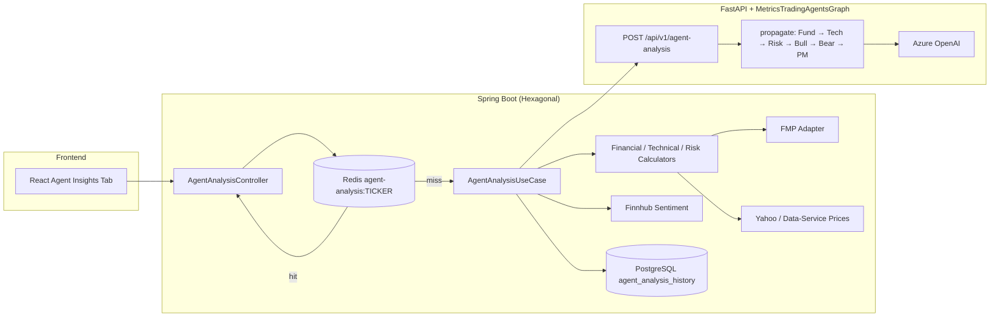

# Agent Analysis Architecture

## Overview

TradingAgents integration follows a **metrics-first** design: Spring Boot aggregates market data and computes all quantitative metrics; FastAPI runs a metrics-only multi-agent reasoning pipeline on Azure OpenAI.

## Cache

| Key | TTL | Payload |
|-----|-----|---------|
| `agent-analysis:{TICKER}` | 15 minutes | decision, confidence, summaries, `generated_at` |

Invalidation: `DELETE /api/v1/agent-analysis/{ticker}/cache` or `DELETE /api/v1/agent-analysis/cache`.

## Observability

| Metric | Layer |
|--------|--------|
| `agent.analysis.cache` (hit/miss) | Spring |
| `agent.execution.time` | Spring |
| `agent.analysis.latency` | Spring → FastAPI client |
| `agent.azure.tokens` | Spring + Prometheus on data-service |
| `agent_analysis_latency_seconds` | data-service |
| Micrometer tracing (OTel bridge) | Spring |

## Persistence

Table `agent_analysis_history`: `id`, `ticker`, `decision`, `confidence`, `analysis_json`, `created_at`.

Migration: `backend/src/main/resources/db/migration/V2__agent_analysis_history.sql`.
