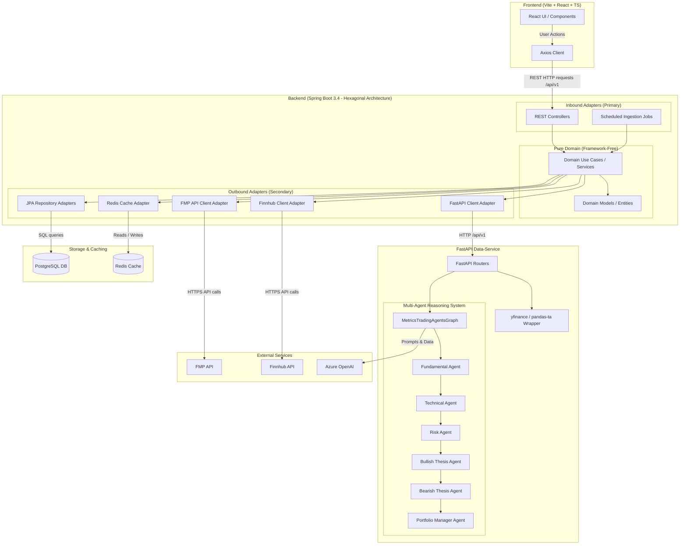
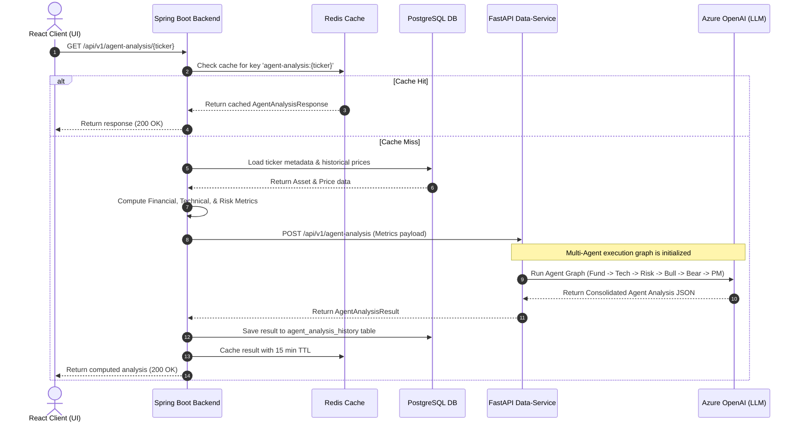

# System Architecture

This document provides a comprehensive overview of the System Architecture for the **Finance Project**, detailing the communication patterns, hexagonal architecture layout of the backend, FastAPI data-service capabilities, caching strategy, and database layout.

---

## 1. High-Level Architecture Diagram

The system is composed of a Vite+React frontend, a Spring Boot backend acting as the central API gateway and orchestrator, a FastAPI data-service for technical analysis and agent-based reasoning, a Redis cache, and a PostgreSQL database.

---

## 2. Key Components and Communication Patterns

### 2.1 Frontend Communication
- Built with **React**, **TypeScript**, **Vite**, and React Router browser routes.
- Styled using design tokens declared in `frontend/src/index.css`.
- The Axios HTTP client (`frontend/src/api/client.ts`) communicates exclusively with the Spring Boot backend on `http://localhost:8080/api/v1`.
- Browser routes such as `/dashboard`, `/portfolio/{portfolioId}`, `/news/{symbol}`, and `/reports/{symbol}` are frontend-only routes and are distinct from backend `/api/v1` endpoints.
- State management and side-effects are organized via custom hooks (e.g., `useAgentAnalysis.ts`), with page-level state composed in `Dashboard.tsx` and transient UI state kept in components.

### 2.2 Backend (Hexagonal Architecture)
To maintain long-term maintainability, the backend codebase is partitioned into three key packages:
1. **Domain Model**: Framework-free Java classes (e.g., `Asset`, `PriceHistory`) that contain core logic and enforce system invariants at construction time.
2. **Domain Port (Outbound)**: Interfaces defining what capabilities the domain needs (e.g., repository interfaces, external api client interfaces).
3. **Adapters**:
   - *Inbound (Primary)*: REST controllers (`PriceController`, `AssetController`, `AgentAnalysisController`) and scheduled tasks (`PriceIngestionJob`) that drive the application.
   - *Outbound (Secondary)*: Implementations of the ports (e.g., JPA repositories, Redis caching adapters, and REST clients targeting FMP/FastAPI).
- All pure domain use-case beans are registered programmatically in `DomainConfig.java` to prevent Spring framework annotations from leaking into the pure domain package.

### 2.3 FastAPI Data-Service
- Serves as the core analytical engine.
- Uses `yfinance` and `pandas-ta` to calculate technical analysis indicators (requires at least 30 candles).
- Hosts the **Multi-Agent Reasoning System** (`MetricsTradingAgentsGraph`) powered by Azure OpenAI.
- **Agent Analysis Pipeline**:
  1. **Fundamental Agent**: Assesses financial statements and solvency/growth metrics.
  2. **Technical Agent**: Parses price history, moving averages, and technical indicators.
  3. **Risk Agent**: Audits volatility and potential portfolio drawbacks.
  4. **Bullish & Bearish Thesis Agents**: Formulate arguments for positive and negative perspectives.
  5. **Portfolio Manager Agent**: Aggregates all insights to produce a final recommendation (Decision, Confidence, and Summary).

### 2.4 Caching and Persistence
- **Redis Cache**: Used to cache quantitative data and LLM agent analysis results (15-minute TTL) to avoid redundant computation and external API charges.
- **PostgreSQL**: Stores persistent tables such as `assets`, `price_histories`, and `agent_analysis_history` for audit trails and offline analysis.

---

## 3. Core Data Flow Diagram

The following sequence diagram outlines a typical request cycle for generating a Multi-Agent Analysis Report on a specific ticker:

